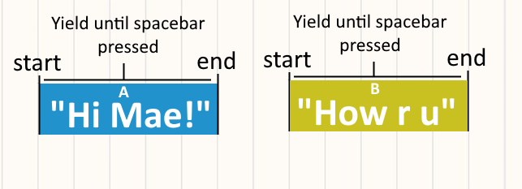

# Ian Wohlers Coding Sample


## Night in the Woods Dialogue System
While cover letters are great, I wanted to provide a concrete example of my coding style, and what it'd be like to collaborate with me. This whole repo was coded up over the last three days under the premise "if I had nothing to go off of, how would I start to build Night in the Woods?" (I had no prior knowledge of tools used to develop NitW like Yarn Spinner)

# Guiding Principles:
Night in the Woods is a *very* writing-heavy game. I figured architecture I plan out for this dialogue system should be usable by a writer - I tried to come up with a syntax that looked like writing stage notes because I assumed that'd be most intuitive for an writer. Basically I knew I needed a text parsed, and I envisioned a system that could take in a full script of text and output a single coroutine that, when started, animates that entire scene.

# Composing Coroutines
I was inspired by [Alan Zucconi' article on nested coroutines](https://www.alanzucconi.com/2017/02/15/nested-coroutines-in-unity/) when thinking about how to sequence dialogue. I started by defining an operation to sequence two coroutines in order:

```
public static IEnumerator SequenceCoroutines(IEnumerator first, IEnumerator second)
{
    yield return first;
    yield return second;
}
```

Imagine we have a basic coroutine that logs a dialogue line, then waits for a user to press "Space"

```
public static IEnumerator SpeechBubble(string text)
{
    Debug.Log(text);
    yield return new WaitUntil(() => Input.GetKeyDown(KeyCode.Space));
}
```

Stitching these speech bubbles together shouldn't be tricky now. To explain with an awful diagram, imagine we want to sequence IEnumerators:
A = SpeechBubble("Hi Mae!"), B = A = SpeechBubble("How are u"), C = SpeechBubble("Bye!")

Here's a diagram of iEnumerators A and B - both just blocks that wait for user input.



Then here's how we visualize the output of OutputIEnum = SequenceCoroutines(A, B)


Finally we want to add on C, so FinalIEnum = SequenceCoroutines(OutputIEnum, C)


That final iEnum, when executed will play the lines "Hi Mae! | How are u | Bye!", in order, waiting for the user to press Space at each break.
In summary, say we have a List\<IEnumerator\> Blocks - then we can sequence them into a single coroutine by doing: `var result = blocks.Aggregate(SequenceCoroutines)`. From here on out we can visualize dialogue as a sequence of coroutine "blocks" we're executing in order - whether those are dialogue bubbles, animations, or so forth. As long as its a coroutine it can be a part of our dialogue system.

# Creating a Parser
(See Dialogue.cs for a full breakdown of the dialogue syntax)

So we've defined dialogue as a sequence of coroutines. The parser's job, then, is to convert blocks of written text into coroutines. Playing creating speech bubbles, dialogue choices, playing animations, and setting variables/flags were all made into coroutines. Ideally I should've translated the text into an AST then defined functions that convert nodes into coroutines, but the parsing so far isn't complicated enought to warrant that. The nested-coroutine strategy nicely parallels the structure of an AST as well, which is just a nested (recursive) data structure.

The syntax here is supposed to look like stage notes, so I tried to keep things as close to that as possible. A line of consisting of `Actor: that actors line` should always be read as a speech bubble. The rest of the syntax revoles around reading the first character to determine the type of the line (? for questions, ! for actions, [] -> for variables because I always thought the R assignment syntax was more intutive than an = for non-programmers). This was... mainly just because that made parsing easier. I think the syntax I defined (especially for choices) is fairly intuitive, but this is the part where I'd most want to consult with writers/artists on what formatting would feel most comfortable for them to write in.

Most parsing only requires looking at a single line, save for the exception of parsing choices (which requires looking ahead until we reach an END), which is the only reason I ended up using a line-by-line iterator to track everything. One of my biggest goals for the parser is that it would look up every reference (mainly animators) *before* a coroutine - that way if we create the coroutine we know there won't be any issues when we eventually execute it. OnValidate uses this to immediately check if the "stage notes" a writer gave it are poorly formatted, making it feel like a "compiler" for stage notes. Each dialogue has a context as well so we can minimize the unseen dependcies they have on other objects in the scene. I'd like to require adding actors to the context for the same reason - I'm undecided if it'd be too tedious to require that, or worth it for making dialogue references easier to track.

# Storing Game State
A lot of visual novels want to store data about important choices a player has made. There's a lot of approaches for this though the most straightforward one is defining some JSON structure for saving your data (I believe Disco Elsyisum does this) and unpacking that json when a player starts their save. IF you just want to transfer data from scene to scene, though, your best tools are scriptable objects - inspired by [a ubiqutous Unite Austin talk on scriptable objects](https://www.youtube.com/watch?v=raQ3iHhE_Kk) I created a boolReference class that allows us to create flags that might be checked in game. Instead of having to remember the names of obscure variables we can drag and drop boolean-references with the Unity UI whenever we need em - making it a lot easier to audit which variables we have that are actually being audited by scripts. Dialogue also respects this principle, requiring clients to drag/drop flags they want to reference into the context. This might be a bit overengineered if we have, say, \< 50 flags to track, but works well with more complex data. SaveEngine is a primitive example of how we could collect all these flag values into one place (and write them into a JSON).

# Extending the Dialogue System
One of my last concerns is admitting that I'll never be able to predict every way a writer might want to write a scene. Maybe a scene requires a very specific complex animation, a QTE, or some other interaction I can't imagine. I made a CustomCoroutine to fix this problem - while you can't really pass a reference to an IEnumerator directly, CustomCoroutine is basically a monobehavior wrapper that lets use write new coroutines we like and insert them into our dialogue. Again, this can be dragged into context, and serve as a kind of "last resort" in case there's something that can't be made possible by extending the parser syntax. One thing I've learned is that I can never fully predict the features somebody will want to add, so I tried to leave some room for "literally anything."

# Conclusions
Thanks for taking the time to read all this! All of these architecture decisions hopefully give an insight into how I think about code - and it's possible that you disagree with a lot them too. That's fantastic - one of the most nervewracking parts of working through this little personal project was having no other engineers to bounce ideas off or sanity check. I tried take fully advantage of Unity's engine to create a foundation that'd be as easy as possible to build upon, and I hope the ideas I described sounded sensible. I'm still pretty happy with the finished product, especially for the amount of time I spent on it.