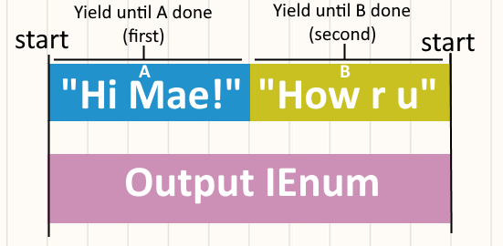
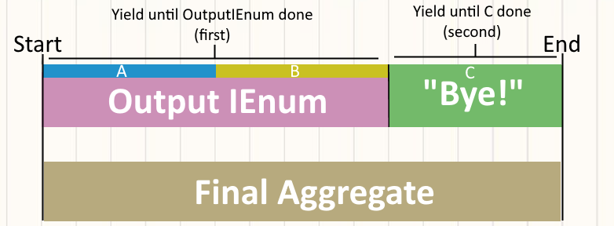

# Ian Wohlers Coding Sample


## Night in the Woods Dialogue System
I wanted to provide a concrete example of my coding style, and what it'd be like to collaborate with me. This whole repo was coded up over the last three days under the premise - "if I had nothing to go off of, how would I start to build Night in the Woods?" (I had no prior knowledge of tools used to develop NitW like Yarn Spinner)

# Guiding Principles:
Night in the Woods is a *very* writing-heavy game. My biggest priority in designing a dialogue system is that it'd be usable *by* a writer - I tried to come up with syntax that looked like stage notes because I felt that'd be most intuitive for a writer. Based on that priority I knew I needed a text parser and I envisioned a system that would consume a full script of "stage notes" and output a single coroutine that, when started, would animate the scene described by the text.

# Composing Coroutines
I was inspired by [Alan Zucconi's article on nested coroutines](https://www.alanzucconi.com/2017/02/15/nested-coroutines-in-unity/) when thinking about how to sequence dialogue. I started by defining an operation to sequence two coroutines in order:

```
public static IEnumerator SequenceCoroutines(IEnumerator first, IEnumerator second)
{
    yield return first;
    yield return second;
}
```

Imagine we have a basic coroutine that logs a dialogue line, then waits for a user to press "Space"

```
public static IEnumerator SpeechBubble(string text)
{
    Debug.Log(text);
    yield return new WaitUntil(() => Input.GetKeyDown(KeyCode.Space));
}
```

I'd like to demo how that SequenceCoroutines method could sequence a few "speech bubbles" in order. To explain with an awful diagram, imagine we want to sequence IEnumerators:

A = SpeechBubble("Hi Mae!"), B = SpeechBubble("How are u"), C = SpeechBubble("Bye!")

Here's a diagram of iEnumerators A and B - both coroutine "blocks" just log on start then wait for user input.


Then here's how we visualize the output of OutputIEnum = SequenceCoroutines(A, B)



Finally we want to add on C, so FinalIEnum = SequenceCoroutines(OutputIEnum, C)



That final iEnum, when executed will play the lines "Hi Mae! | How are u | Bye! |", in order, waiting for the user to press spacebar at each "|".
To generalize, say we have a List\<IEnumerator\> Blocks - we can sequence them into a single coroutine by doing: `var result = blocks.Aggregate(SequenceCoroutines)`. From here on out we can visualize dialogue as a timeline of coroutine "blocks" we're executing in order - whether those are dialogue bubbles, animations, or so forth. As long as its a coroutine it can be a part of our dialogue system. We can also see from this example how blocks can be nested - the final coroutine can be visualized as A -> B -> C, but it could also be thought of as ((A, B) C)

# Creating a Parser
(See Dialogue.cs for a full breakdown of the dialogue syntax)

So we've defined dialogue as a sequence of coroutines. The parser's job, then, is to convert blocks of written text into coroutines. Creating speech bubbles, prompting dialogue choices, playing animations, and setting variables/flags were all made into coroutines that could be generated from text. Ideally I should've split this into two steps: translate the given "stage notes" into an AST first, then define functions that convert *AST nodes* into coroutines, but the parsing so far hasn't been complicated enough to warrant that. I do think that ASTs and nested coroutines would be a *great* match though (given they both have a nested structure).

The syntax for dialogue is supposed to look like stage notes as much as possible. A line of consisting of `Actor: that actors line` should always be read as a speech bubble, because that's exactly how you'd write a play. The rest of the syntax revoles around reading the first character to determine the type of the line (? for choices, ! for actions, [] -> for variables) - mostly just to make parsing easier. I think the syntax I defined (especially for choices) is fairly intuitive, but this is the part where I'd most want to consult with writers/artists on what formatting they'd feel most comfortable writing in.

Most parsing only requires looking at a single line, save for the exception of parsing choices (which requires looking ahead until we reach an END), which is the only reason I ended up using iterator to track everything (rather than converting line-by-line). One of my biggest goals for the parser is that it would look up every reference (mainly animators) *before* a coroutine is started - that way if we can succesfully generate the coroutine then we know there won't be any issues when we eventually execute it. OnValidate uses this to immediately check if the "stage notes" a writer gave it are poorly formatted, making it feel a bit like a compiler for stage notes. Each dialogue has a context as well so we can minimize the unseen dependencies they have on other objects in the scene. I'd like to require adding actors to the context for the same reason, but I'm undecided if it'd be too tedious to require.

# Storing Game State
A lot of visual novels store data about important player decisions. The most straightforward implementation of this is defining some JSON structure for tracking all this data (I believe Disco Elsyisum does this), using that JSON as a save file, and unpacking that json when a player starts their save. If we're not concerned about saving and instead the only goal is to transfer data from scene to scene scriptable objects are my favorite option; inspired by [a ubiqutous Unite Austin talk on scriptable objects](https://www.youtube.com/watch?v=raQ3iHhE_Kk) I created a boolReference class that allows developers to create boolean flags that might be checked in game. Rather than having to remember the names of obscure variables a developer can instead drag and drop boolean-references within the Unity UI itself, making it a lot easier to audit which variables are actually reference in a scene (or across our game). Dialogue works with these references as well, allowing clients to drag/drop flags they want to reference into the context. This might be a bit overengineered if we have, say, \< 50 flags to track, but works well with more complex data. SaveEngine is a primitive example of how we could collect all these flag values into one place (and write them into a JSON).

# Extending the Dialogue System
One of my last hurdles is admitting that I'll never be able to predict every way a writer might want to make a scene. Maybe a scene requires a very specific complex animation, a QTE, or some other interaction I can't imagine. I made the CustomCoroutine class to fix this problem - while you can't really pass a reference to an IEnumerator directly, CustomCoroutine is basically a monobehavior wrapper that lets us write new coroutines inside scripts and insert them into our dialogue. Again, these coroutines can be dragged into the dialogue context, and serve as a kind of "last resort" in case there's something that can't be made possible by only extending the parser. I've learned I can never fully predict the features somebody will want to add, so I tried to leave some room in the code for "literally anything."

# Conclusions
Thanks for taking the time to read all this! All of these architecture decisions hopefully give an insight into how I think about code - and it's possible that you disagree with a lot them too. Maybe you think I lean too hard into functional programming, or you think the code I've written has overcomplicated a simple problem. That's fantastic! One of the most nervewracking parts of working through this little personal project was having no other engineers to bounce ideas off of. Altogether, though, I'm still pretty happy with the finished product, especially for the amount of time I spent on it.